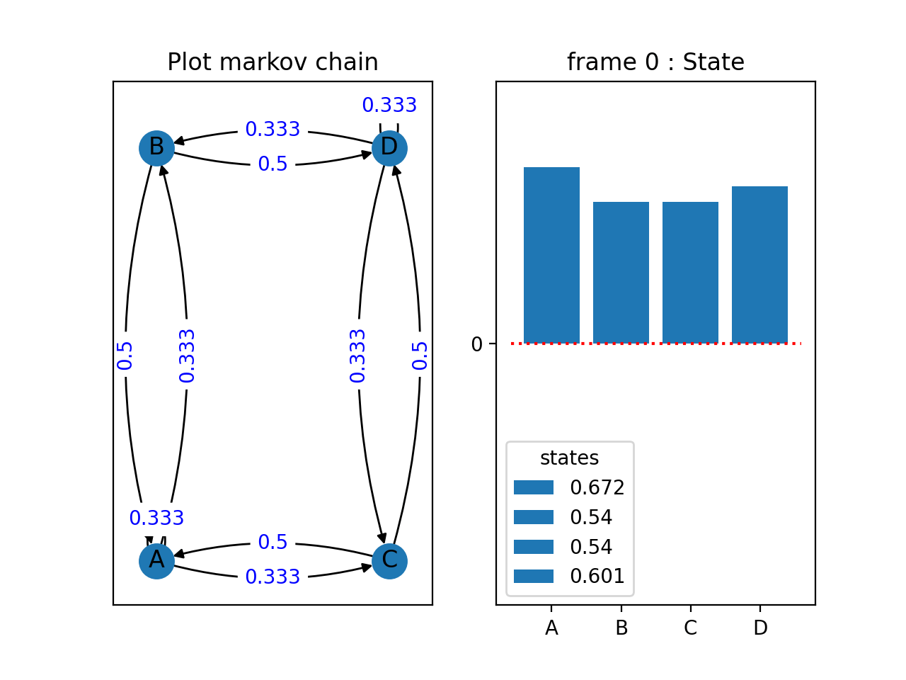

# Plot and Animation

Markov Chain with 4 nodes:

1. Initialize states of four nodes with samples from a standard normal
distribution.

2. Set the transition matrix W such that the weights on edges has the following
   transition probability 
   `w = 1/$num_of_edges`

3. Update states by multiplying the transition matrix W with previous states
    `new_states = W @ states`

Results after 24 frames:

